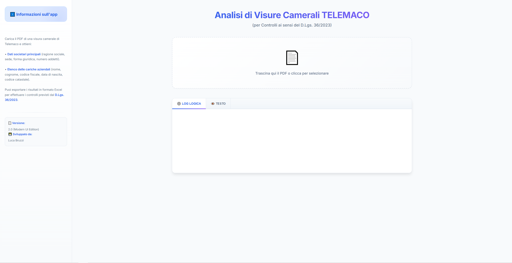
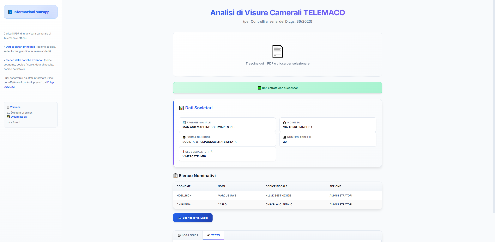

# Analisi di Visure Camerali TELEMACO

**Analisi automatizzata e intelligente di Visure Camerali per controlli D.Lgs. 36/2023.**

Questa applicazione web "stand-alone" permette di estrarre istantaneamente dati societari e nominativi dai PDF delle visure camerali scaricate da Telemaco. La versione 2.0 introduce una nuova **Modern UI** con animazioni fluide, un design ottimizzato per la leggibilità e una logica di estrazione ancora più raffinata.

## 📸 Screenshot
### Interfaccia di Caricamento

*La nuova interfaccia moderna con supporto Drag&Drop e animazioni di stato.*

### Analisi e Risultati

*Visualizzazione chiara dei dati societari e della tabella nominativi pronta per l'export.*

🚀 Funzionalità Principali
- Estrazione Dati Societari: Recupera Ragione Sociale, Forma Giuridica, Sede, Indirizzo e Numero Addetti.
- Analisi dei Nominativi: Identifica i soggetti presenti nelle sezioni Amministratori, Soci, Sindaci e Titolari di cariche.
- Reverse Engineering del Codice Fiscale: Decodifica automaticamente la data di nascita e il codice catastale del comune di nascita partendo dal CF.
- Esportazione Excel: Genera un file .xlsx ("Elenco per casellario.xlsx") formattato per i controlli di compliance.
- Logica Anti-Errore: Filtra automaticamente termini tecnici e parole "junk" per garantire la pulizia dei nomi estratti.

## ✨ Novità Versione 2.0 (Modern UI Edition)
- **Design Professionale**: Interfaccia basata sul font *Inter* con ombreggiature soffuse e gradienti moderni.
- **User Experience migliorata**: Feedback visivi immediati durante il caricamento e l'elaborazione del file.
- **Responsive Design**: Sidebar laterale e griglie di dati che si adattano a diverse risoluzioni dello schermo.

## 🛡️ Privacy e Sicurezza locale
- Elaborazione Locale: Il file PDF viene elaborato interamente all'interno del browser dell'utente.
- Nessun Upload: Nessun dato viene caricato o inviato a server esterni; l'applicazione è un file HTML "stand-alone".
- Conformità: Questo approccio garantisce la massima protezione nel trattamento dei dati sensibili contenuti nelle visure camerali.

## 📋 Modalità d'uso
1. Apri `index.html` in qualsiasi browser moderno.
2. Trascina la visura PDF nell'area centrale.
3. Verifica i dati estratti nella dashboard.
4. Scarica il file Excel per le tue procedure amministrative.

## 🛠️ Tecnologie
- **Librerie**: PDF.js (Parsing), SheetJS (Excel generation).
- **Stile**: CSS Custom Properties, Inter Font, Web Animations.

---

**Sviluppatore**: Luca Bruzzi | **Versione**: 2.0 (Modern UI)
